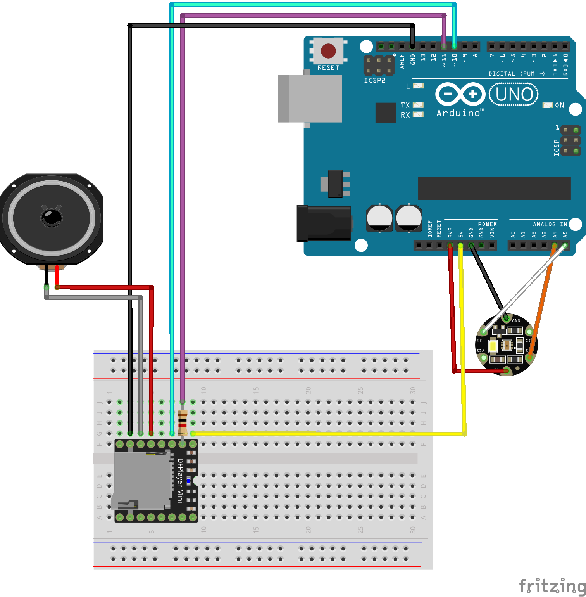

# Final Projects

## Color-Music Player

### Goal

The goal of the projects is offering emotional experience associated with colors for colorblind people.

### Choice of hardware & software

Flora color sensor reads the color of the object and plays the music that can be related to the color. DFPlayer with micro SD card was used to play the music. I studied simple tutorials using Flora color Sensor with RGB LED and DFPlayer playing audio files.  Audio files are selected based on color psychology. 


### Schematic



### Parts List
* Flora color sensor
* DFPlayer
* Micro SD card
* Speaker

### Process Images 


First process using waveshield.


Studying color sensor and RGB LED


Connecting waveshield and Color Sensor


Connecting DFPlayer and Flora Color Sensor


Final form 

### Video
[Demonstration Video](https://vimeo.com/267797226)

### Code/Comment
>* [Code](https://github.com/TaeyoungYun49/arduino_2018/tree/master/Final%20Documentation/code/music-color)

```cpp
#include "Arduino.h"
#include "SoftwareSerial.h"
#include "DFRobotDFPlayerMini.h"
#include "Wire.h"
#include "Adafruit_TCS34725.h"

Adafruit_TCS34725 tcs = Adafruit_TCS34725(TCS34725_INTEGRATIONTIME_50MS, TCS34725_GAIN_1X);
bool flag = true;
SoftwareSerial mySoftwareSerial(10, 11); // RX, TX
DFRobotDFPlayerMini myDFPlayer;

unsigned long previousMillis = 0;
const long interval = 20000;
void printDetail(uint8_t type, int value);

void setup() {
  //color
  Serial.begin(9600);

  //mp3
  mySoftwareSerial.begin(9600);
  Serial.begin(115200);      

  Serial.println();
  Serial.println(F("DFRobot DFPlayer Mini Demo"));
  Serial.println(F("Initializing DFPlayer ... (May take 3~5 seconds)"));

  if (!myDFPlayer.begin(mySoftwareSerial)) {  //Use softwareSerial to communicate with mp3.
    Serial.println(F("Unable to begin:"));
    Serial.println(F("1.Please recheck the connection!"));
    Serial.println(F("2.Please insert the SD card!"));
    while (true);
  }
  Serial.println(F("DFPlayer Mini online."));

  myDFPlayer.setTimeOut(500); //Set serial communictaion time out 500ms

  //----Set volume----
  myDFPlayer.volume(25);  //Set volume value (0~30).
  //----Set different EQ----
  myDFPlayer.EQ(DFPLAYER_EQ_NORMAL);
 
  //----Set device, use SD as default----
  myDFPlayer.outputDevice(DFPLAYER_DEVICE_SD);
}

void loop() {

  unsigned long currentMillis = millis();

  // The sensor returns values ​​for R, G, B and a Clear value
  uint16_t clearcol, red, green, blue;
  float average, r, g, b;
  delay(500); 
  tcs.getRawData(&red, &green, &blue, &clearcol);

 // color values ​​by average, 
 // all values ​​now move around 1 
  average = (red + green + blue) / 3;
  r = red / average;
  g = green / average;
  b = blue / average;

 // output the clear value and r, g, b serially for control 
 // r, g and b should be between approx. 0.5 and 1.5 
 //. If the sensor looks red, then r should be well above 1.0 
 //, g and b between 0.5 and 1.0, and so on  
  Serial.print("\tClear:"); Serial.print(clearcol);
  Serial.print("\tRed:"); Serial.print(r);
  Serial.print("\tGreen:"); Serial.print(g);
  Serial.print("\tBlue:"); Serial.print(b);

  if  ((r > 1.8) && (g < 0.6) && (b < 0.6)) {
    if (flag) {
      flag = false;
      Serial.print("\tred");
      myDFPlayer.playMp3Folder(1); //play specific mp3 in SD:/MP3/0001.mp3
    }
  }

  else if ((r < 0.95) && (g > 1.3) && (b < 0.85)) {
    if (flag) {
      flag = false;
      Serial.print("\tgreen");
      myDFPlayer.playMp3Folder(2); //play specific mp3 in SD:/MP3/0002.mp3
    }
  }

  else if ((r < 0.8) && (g < 1) && (b > 1.4)) {
    if (flag) {
      flag = false;
      Serial.print("\tblue");
      myDFPlayer.playMp3Folder(3); //play specific mp3 in SD:/MP3/0003.mp3
    }
  }
  else if ((r > 1.1) && (g > 1.1) && (b < 0.75)) {
    if (flag) {
      flag = false;
      Serial.print("\tyellow");
      myDFPlayer.playMp3Folder(4); //play specific mp3 in SD:/MP3/0004.mp3
    }
  }
  else {
    flag = true;
    if (currentMillis - previousMillis >= interval) {
      previousMillis = currentMillis;
      myDFPlayer.pause();  //pause the mp3
    }
  }

  // Output line change
  Serial.println("");
  delay(100);

}
```


## 2. Exercising with Car Engine Sound

### Goal

Motivate car guy users to keep up with physical therapy by using car engine sounds as audio feedback.

### Choice of hardware & software

Myoware muscle sensor detects muscle flexion and relaxation and triggers different car sounds. 

### Schematic

(Lilypad mp3, muscle sensor parts are not available on Fritzing)

### Parts List
* MyoWare Muscle Sensor
* Lilypad mp3 player
* LED
* Speaker
* 5V battery

### Final Form 


### Video
[Start the exercise](https://vimeo.com/267796063)
[While exercising](https://vimeo.com/267796398)

### Code/Comment
>* [Code](https://github.com/TaeyoungYun49/arduino_2018/tree/master/Final%20Documentation/code/ExerciseWithCarSound)

```cpp
#include <SPI.h>                // To talk to the SD card and MP3 chip
#include <SdFat.h>              // SD card file system
#include <SFEMP3Shield.h>       // MP3 decoder chip
#include <Adafruit_NeoPixel.h>  // NeoPixel library

// Constants for the trigger input pins
// in an array 
const int TRIG1 = A0;
const int TRIG2 = A4;
const int TRIG3 = A5;
const int TRIG4 = 1;
const int TRIG5 = 0;
int trigger[5] = {TRIG1,TRIG2,TRIG3,TRIG4,TRIG5};

// outputs
const int ROT_LEDR = 10; // Red LED in rotary encoder
const int EN_GPIO1 = A2; // Amp enable + MIDI/MP3 mode select
const int SD_CS = 9;     // Chip Select for SD card

// Create library objects:
SFEMP3Shield MP3player;
SdFat sd;
boolean interrupt = true; // set triggered file to be able to be interrupted.
boolean interruptself = true; // set triggered file to interrupt itself.


// Store five filenames as arrays of characters.
char filename[9][13];
int iThreshold			= 280; 
const int NeoPixelPin           = 5; // pin connected to the Glove
bool bPreviousState		= false;
bool firstLoop                  = true;
long POWERUP_SFX_LENGTH = 1080; //ms
long POWERDWN_SFX_LENGTH = 1250; //ms
long FIRE_SFX_LENGTH = 1828; //ms
long LED_MAX = 255;
long brightnessValue = 1;

Adafruit_NeoPixel strip = Adafruit_NeoPixel(12, NeoPixelPin, NEO_GRB + NEO_KHZ800);

void powerUp() 
{
  brightnessValue = 1;
  MP3player.playMP3(filename[7]);

  // fade in variables  
  long currTime = millis();
  long prevTime = currTime;
  long brightnessStart = brightnessValue;
  long brightnessEnd = 20;
  long timeDivision = POWERUP_SFX_LENGTH/(abs(brightnessEnd-brightnessStart)); 
  
  while (MP3player.isPlaying()) 
  {
    // fade in from min to max over length of clip:
    currTime = millis();
    if(currTime-prevTime >= timeDivision)
    {
      brightnessValue +=1;

      // update glove LEDs
      if(brightnessValue <= brightnessEnd)
      {
        strip.setBrightness(brightnessValue);
        for(int i=0; i<strip.numPixels(); i++) {strip.setPixelColor(i, strip.Color(127, 0, 0));}
        strip.show();
      }		   

      prevTime = currTime;
    }  	  

    if(interrupt)
    {
      boolean bState = ReadMuscleSensor(TRIG1);
      if(!bState)
        MP3player.stopTrack();
        
      ReadMP3PlayerTriggers();
    }
  }
}

void fire() 
{

  boolean bState = false;

  MP3player.playMP3(filename[8]);
  
  int colorValue = 0;
  // turn on the glove LEDs
  while(brightnessValue < LED_MAX)
  {
    brightnessValue++;
    strip.setBrightness(brightnessValue);
    for(int i=0; i<strip.numPixels(); i++) {strip.setPixelColor(i, strip.Color(127, colorValue, colorValue));}
    strip.show();
    if(colorValue < 127)
      colorValue++;	
  }
  
  // fade out over length of clip:
  while (MP3player.isPlaying()) 
  {    
    if(brightnessValue > 20)
      brightnessValue--;
    strip.setBrightness(brightnessValue);
    for(int i=0; i<strip.numPixels(); i++) {strip.setPixelColor(i, strip.Color(127, colorValue, colorValue));}
    strip.show();
    if(colorValue > 0)
      colorValue--;
    
    if(interrupt)
    {
      bState = ReadMuscleSensor(TRIG1);    
      if(bState)
        MP3player.stopTrack();
        
      ReadMP3PlayerTriggers();
    }      
  }

  if(!bState)
  { 
    // now power down
    MP3player.playMP3(filename[0]);

    //setup fade out variables
    long currTime = millis();
    long prevTime = currTime;
    long brightnessStart = brightnessValue;
    long brightnessEnd = 1;
    long timeDivision = POWERDWN_SFX_LENGTH/(abs(brightnessEnd-brightnessStart)); // clip length in milliseconds divided by the desired LED brightness value

    while (MP3player.isPlaying()) 
    {
      // fade out from max to min over length of clip:
      currTime = millis();
      if(currTime-prevTime >= timeDivision)
      {
        if(brightnessValue > brightnessEnd)
          brightnessValue--;
          
        if(colorValue > 0)
          colorValue--;
        
        // update glove LEDs
        strip.setBrightness(brightnessValue);
        for(int i=0; i<strip.numPixels(); i++) {strip.setPixelColor(i, strip.Color(127, colorValue, colorValue));}
        strip.show();		   

        prevTime = currTime;
      }  	  

      if(interrupt)
      {
        bState = ReadMuscleSensor(TRIG1);
        if(bState)
          MP3player.stopTrack();
        
        ReadMP3PlayerTriggers();
      }
    }
  }     

  for(int i=0; i<strip.numPixels(); i++) {strip.setPixelColor(i, 0);}
  strip.show();	// turn off the glove LEDs
}

//ReadMuscleSensor

bool ReadMuscleSensor(int iMuscleSensorPin)
{
  int val = analogRead(iMuscleSensorPin);    

  if(val >= iThreshold)
    return true;
  else
    return false;
}


// Lilypad MP3 Player

void SetupMP3Player()
{
  byte result;
  pinMode(EN_GPIO1,OUTPUT);
  digitalWrite(EN_GPIO1,LOW);  // MP3 mode / amp off

  result = sd.begin(SD_CS, SPI_HALF_SPEED); // 1 for success
  
  if (result != 1) // Problem initializing the SD card
    errorBlink(1); // Halt forever, blink LED if present.
  
  // Start up the MP3 library
  result = MP3player.begin(); // 0 or 6 for success

  // Check the result, see the library readme for error codes.
  if ((result != 0) && (result != 6)) // Problem starting up
    errorBlink(result); // Halt forever, blink red LED if present.

  FindAudioFilenames();

  // Set the VS1053 volume. 0 is loudest, 255 is lowest (off):
  MP3player.setVolume(0,255);
  
  // Turn on the amplifier chip:  
  digitalWrite(EN_GPIO1,HIGH);
}

void FindAudioFilenames()
{
  SdFile file;
  char tempfilename[13];
  int index;
  // access the SD card to look for any (audio) files
  // starting with the characters '1' to '5':

  // Start at the first file in root and step through all of them:
  sd.chdir("/",true);
  while (file.openNext(sd.vwd(),O_READ))
  {
    // get filename
    file.getFilename(tempfilename);

    // Does the filename start with char '1' through '10'?
    if (tempfilename[0] >= '1' && tempfilename[0] <= '10')
    {
      // Yes! subtract char '1' to get an index of 0 through 4.
      index = tempfilename[0] - '1';
      
      // Copy the data to our filename array.
      strcpy(filename[index],tempfilename);
    }
    file.close();
  }
}

void ReadMP3PlayerTriggers()
{
  int t;              // current trigger
  static int last_t;  // previous (playing) trigger
  int x;
  byte result;
  
  // Step through the trigger inputs, looking for LOW signals.
  for(t = 2; t <= 5; t++)
  {
    // The trigger pins are stored in the inputs[] array.
    // Read the pin and check if it is LOW (triggered).
    if (digitalRead(trigger[t-1]) == LOW)
    {
      x = 0;
      while(x < 50)
      {
        if (digitalRead(trigger[t-1]) == HIGH)        {x++;}
        else                                          {x = 0;}      
        
        delay(1);
      } 

      // stop the playback before playing the new file.
      if (interrupt && MP3player.isPlaying() && ((t != last_t) || interruptself))
      {
        MP3player.stopTrack();
      }

      // Play the filename associated with the trigger number.
      result = MP3player.playMP3(filename[t-1]);
      if (result == 0) last_t = t;  // Save playing trigger  
      
    }
  }
}

void errorBlink(int blinks)
{
  // The following function will blink the repulsor a given number of times and repeat forever. 
  int x;

  while(true) // Loop forever
  {
    for (x=0; x < blinks; x++) // Blink the given number of times
    {
      for(int i=0; i<strip.numPixels(); i++) {strip.setPixelColor(i, strip.Color(127, 0, 0));}
      strip.show(); // Turn LED ON
      delay(250);
      for(int i=0; i<strip.numPixels(); i++) {strip.setPixelColor(i, 0);}
      strip.show(); // Turn LED OFF
      delay(250);
    }
    delay(1500); // Longer pause between blink-groups
  }
}


void IncrementAndDirection(int &value, const int minValue, const int maxValue, 
                const int incValue, bool &forward )
{
  if(forward && value >= maxValue)
    {
      value = maxValue;
      forward = !forward;
    }    
    else if(!forward && value <= minValue)
    {
      value = minValue;
      forward = !forward;
    }
    
    if(forward)
      value = value + incValue;
    else
      value = value - incValue; 
}

// The colours are a transition r - g - b - back to r.
uint32_t Wheel(byte WheelPos) {
  WheelPos = 255 - WheelPos;
  if(WheelPos < 85) {
    return strip.Color(255 - WheelPos * 3, 0, WheelPos * 3);
  } 
  else if(WheelPos < 170) {
    WheelPos -= 85;
    return strip.Color(0, WheelPos * 3, 255 - WheelPos * 3);
  } 
  else {
    WheelPos -= 170;
    return strip.Color(WheelPos * 3, 255 - WheelPos * 3, 0);
  }
}


void setup()
{

  int x, index;
  SdFile file;
  byte result;
  char tempfilename[13];

  // Setup the five trigger pins 
  for (x = 0; x <= 4; x++)
  {
    pinMode(trigger[x],INPUT);
    if(x > 0)
      digitalWrite(trigger[x],HIGH);
  }
  
  // Setup the repulsor LED PWM pin 
  pinMode(NeoPixelPin, OUTPUT); 
  
  //
  SetupMP3Player();
  
  delay(20);
}

void loop()
{  
  if(firstLoop)
  {

    MP3player.playMP3(filename[5]);
    
    for(int i=0; i<strip.numPixels(); i++) {strip.setPixelColor(i, 0);}
    int pixelIndex = 0;
    int colorIndex = 0;
    while (MP3player.isPlaying())
    {
      // the NeoPixel ring varying brightness and color
      int numCluster = 3;
      bool fwdColor = true;     
      const int colorInc = 5;  
      
      // turn on leading NeoPixel
      strip.setBrightness(20);
      strip.setPixelColor(pixelIndex, Wheel(colorIndex % 255));      
      // turn off trailing NeoPixels
      if(pixelIndex-numCluster >= 0)
        strip.setPixelColor(pixelIndex-numCluster, 0);       
      else
        strip.setPixelColor(strip.numPixels() + (pixelIndex-numCluster), 0);         
      strip.show();
  
      IncrementAndDirection(colorIndex, 0, 255, 5, fwdColor);     // color: min=0, max=255, increment=5
      pixelIndex++;  
  
      if(pixelIndex > strip.numPixels())
        pixelIndex = 0;
  
      delay(50);  
    }  
    
    // turn all NeoPixels off
    for(int i=0; i<strip.numPixels(); i++) {strip.setPixelColor(i, 0);}
    
    MP3player.playMP3(filename[6]);
    
    // color wipe green
    int brightIndex = 20;
    strip.setBrightness(brightIndex);
    for(int i=0; i<strip.numPixels(); i++) {strip.setPixelColor(i, strip.Color(0, 127, 0));strip.show();delay(50);}          
    
    bool fwdBright = false;         
    while (MP3player.isPlaying())
    {
      strip.setBrightness(brightIndex);
      for(int i=0; i<strip.numPixels(); i++) {strip.setPixelColor(i, strip.Color(0, 127, 0));}    
      strip.show();
  
      IncrementAndDirection(brightIndex, 3, 20, 1, fwdBright);   // brightness: min=1, max=255
      delay(25);  
    }
    for(int i=0; i<strip.numPixels(); i++) {strip.setPixelColor(i, 0);strip.show();delay(50);}          
    firstLoop = false;
  }
  
  // Read the muscle sensor value
  boolean bState = ReadMuscleSensor(TRIG1);
  if(bState && !bPreviousState)
  {
    //digitalWrite(NeoPixelPin, HIGH);  // Turn the repulsor on when flexing
    powerUp();                    // Play the Repulsor Power Up SFX
  }
  else if(!bState && bPreviousState)
  {
    //digitalWrite(NeoPixelPin, LOW); // Turn the repulsor off when relaxed    
    fire();       // Play the Repulsor Firing and Power Down SFXs    
  }

  // Store state for next loop
  bPreviousState = bState;  
  
  // Check to see
  ReadMP3PlayerTriggers();
  
  delay(50);
}

```
