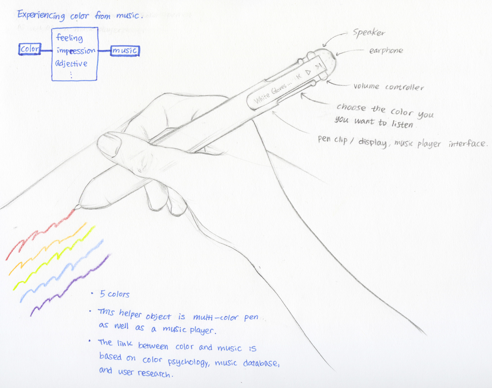
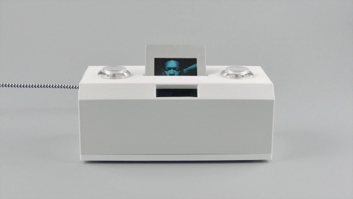
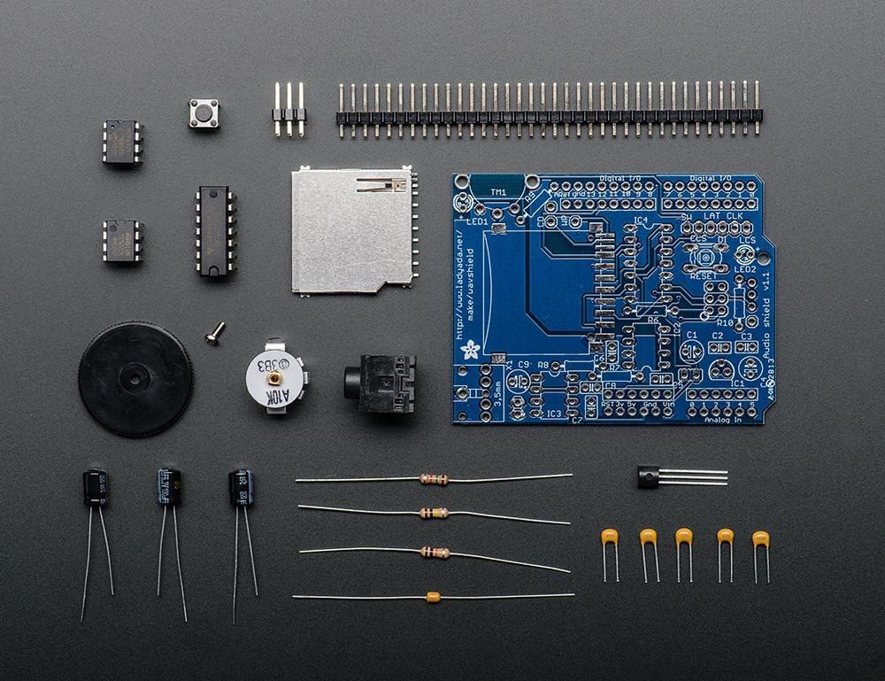
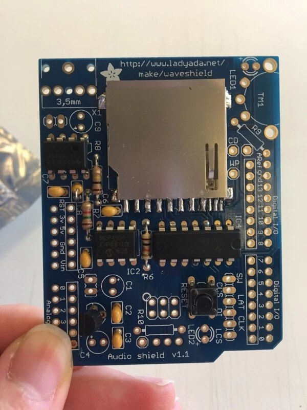
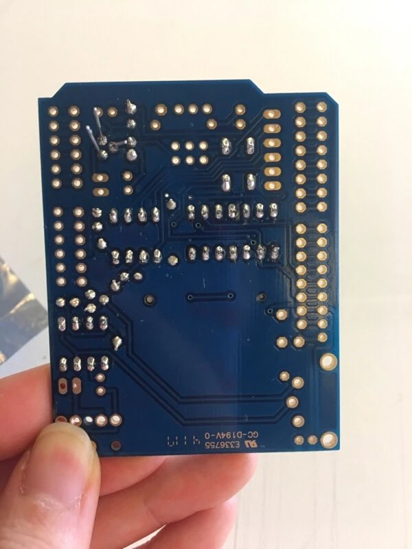
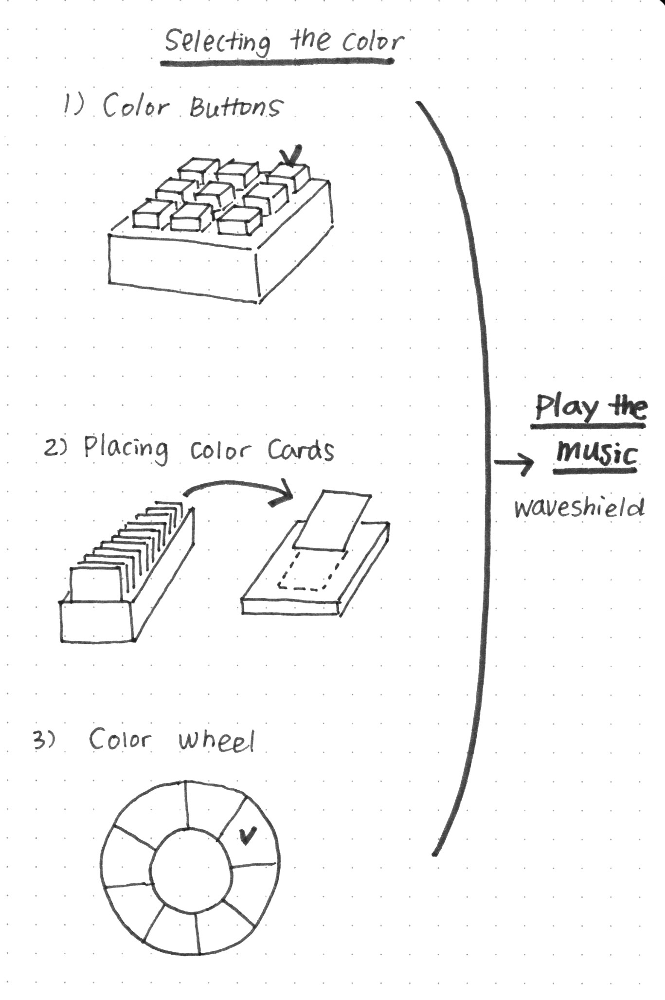

# Midterm Project Documentation

## Color-Feel music playing kit

### Concept Description

This project is inspired by the design research project for colorblind people. From many conversations and interviews with Nathan born with colorblindness, I learned that he could see colors with Enchroma glasses on, but he never felt like he understands or feels the concept of 'color.' He felt like visual art experience is missing in his entire life. 

I wanted to offer emotional experience associated with colors such as red for passion, love, energy, strength, and more. I asked what sensory stimulation invoke emotion most for him other than vision, and he said, "music." He enjoys karaoke nights, plays in a band, and writes songs. Thus, I wanted to make an object that helps him connect his feelings about music and different colors. With Color-Feel music playing kit, he can make an emotional connection with the color by selecting a specific color and listening to the music that has a feeling of the color.

### First Idea Sketch

My initial idea was making the music player in a 'pen' form. But after researching Arduino references, I decided to make the music player using multiple buttons form.

Reference 

*[Plastic Player](http://newtechno.club/2018/02/27/plastic-player-2-open-source-music-controller-analog-interface-for-digital-music/): Analog Interface for digital Music.

*[PianoGlove](https://learn.adafruit.com/pianoglove/what-youll-need) : Convert color to music with a wave of your finger.
*[Veri Pen](https://jihoonsuh.com/veripen/)

### Process: soldering, soldering, soldering…
Adafruit Wave Shield : [Examples](https://learn.adafruit.com/adafruit-wave-shield-audio-shield-for-arduino/examples)

Soldering many hours...

Almost Done...

Done!

### Working Prototype
[Watch Video](https://youtu.be/pFclCZ3zloQ)

### Code & Schematic
[Tutorial and Code](https://cdn-learn.adafruit.com/downloads/pdf/adafruit-wave-shield-audio-shield-for-arduino.pdf)

### Further Development for Final Project
* Designing 'Selecting Color' Part
* Researching color psychology and music
* Connecting buttons and Wave Shield
* Building physical parts and refining the design

